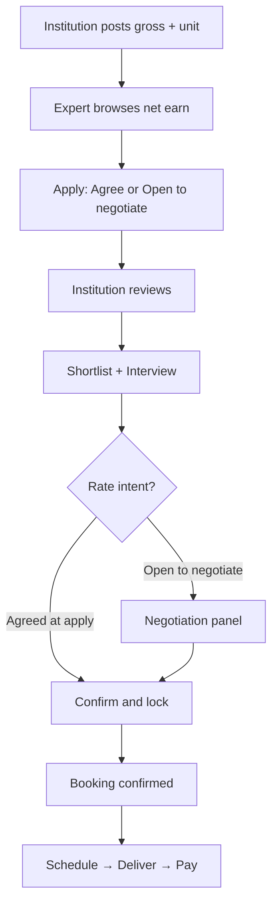

# Calxmap — Pricing & Negotiation UX Flow

**Purpose:** UI/UX spec for how institutions and experts see rates, apply, negotiate, and lock compensation before booking.  
**Audience:** Product, design, development, QA  
**Date:** July 2026  
**Related docs:** `PRICING_AND_COMPENSATION_MODEL.md`, `TRAINING_ATTENDANCE_RECTIFIED_FLOW.md`

---

## Executive summary

1. **Experts see NET** (“You earn ₹X per session”). **Institutions see GROSS** (“You pay ₹X per session”). Platform commission (30%) is never shown as a multiplier in the UI.
2. **At apply, only two choices:** agree to posted rate **or** open to negotiate. **No proposed amount at apply.**
3. **After shortlist / interview**, experts who chose “open to negotiate” can send a **proposed net rate**. Institution counters in **gross**.
4. **“Agree to rate” is a commitment** — expert cannot propose a higher rate later without a scoped reason (e.g. extra session, travel).
5. **Booking is created only after rates are agreed** — on a **Confirm & lock** screen, not a blank “final hourly rate” field.

**One-line rule:**

> **Apply = intent only. Interview = numbers. Accept = lock.**

---

## Core UX rules (every screen)

| Rule | Detail |
|------|--------|
| Expert-facing copy | Always **“You earn”** + amount + **unit** (per session / per day / package / per hour) |
| Institution-facing copy | Always **“You pay”** + amount + **unit** |
| Never show | `× 1.30`, “markup”, or raw commission math in primary UI |
| Always show | Compensation **unit** — not everything as hourly |
| Apply | Light touch — fit and availability, not full contract |
| Interview | Rate discussion happens here |
| Accept | Single lock summary → booking |

**Label pattern:**

```
Institution:  You pay     ₹10,000 / session
Expert:       You earn    ₹7,000 / session
(small grey)  Platform fee included in institution price
```

**Commission (backend only):**

```
expert_net = gross × 0.70
gross      = expert_net / 0.70   (when expert proposes net)
```

---

## End-to-end journey

```
Institution posts requirement (gross + unit)
        ↓
Expert browses (sees net earn)
        ↓
Expert applies (agree | open to negotiate)
        ↓
Institution reviews applications (badges, no rate spam)
        ↓
Shortlist → Interview scheduled
        ↓
[If open to negotiate] Expert sends proposed net → Institution counters in gross
        ↓
Rate agreed
        ↓
Institution: Confirm & lock → Booking created (confirmed)
        ↓
Schedule plan → Training / attendance → Pay on locked rates
```



---

## Phase 1 — Institution posts requirement

Dynamic form (see `PRICING_AND_COMPENSATION_MODEL.md` for field matrix). Institution enters **gross** and **unit**; system derives net, total budget, and total hours.

**Example — Guest lecture:**

```
How will you pay?     ● Per session
You pay per session   ₹ 10,000
Number of sessions    2
Duration per session  2 hours
─────────────────────────────────
Total you pay         ₹20,000
Total engagement      4 hours
Expert typically earns ~₹7,000/session
Period                1 Aug – 31 Aug 2026
```

**Expert browse card (what they see):**

```
Guest Lecture · 2 sessions · 4 hrs total
You earn ~₹7,000 / session
~₹14,000 approx. total
📅 1 Aug – 31 Aug
```

**Optional warning** if posted net is below expert’s profile minimum:

```
⚠ Posted rate is below your profile minimum (₹8,000/session).
  Consider choosing “Open to negotiate” when you apply.
```

---

## Phase 2 — Expert applies (two options only)

**Design decision:** Do **not** show a proposed rate field at apply. Only two radio options.

### Apply modal layout

```
┌─────────────────────────────────────────────┐
│ Apply to: Machine Learning Guest Lecture    │
│                                             │
│ Posted compensation                         │
│   You earn ~₹7,000 / session (2 sessions)   │
│   ~₹14,000 total · 4 hours                  │
│                                             │
│ Rate preference *                           │
│ ● I agree to the posted rate                │
│ ○ I'm open to negotiate if shortlisted      │
│                                             │
│ Optional note (no amounts)                  │
│ [e.g. Travel from another city]             │
│                                             │
│ Cover letter                                │
│ Interview availability                      │
│                                             │
│        [Cancel]  [Submit application]       │
└─────────────────────────────────────────────┘
```

### What each option means

| Choice | Stored value | Institution badge |
|--------|--------------|-------------------|
| **I agree to the posted rate** | `rate_intent: agreed_posted` | Green — **Accepted posted rate** |
| **Open to negotiate if shortlisted** | `rate_intent: open_to_negotiate` | Amber — **Open to negotiate** |

### Why not three options at apply?

| Propose rate at apply | Two options only (recommended) |
|-----------------------|--------------------------------|
| Institution gets many random numbers | Reviews fit first |
| Higher apply friction | Faster, more applications |
| Experts guess without context | Numbers when engagement is real |
| Noisy application list | Clean badges: agreed vs negotiate |

---

## Phase 3 — Institution reviews applications

**Project → Applications tab.** Each card shows rate **intent**, not hourly chaos.

```
┌─────────────────────────────────────────────┐
│ Dr. Sharma · 12 yrs · ★ 4.8                │
│ 🟢 Accepted posted rate                     │
│   (or 🟡 Open to negotiate)                 │
│                                             │
│ Cover letter excerpt…                       │
│ Interview slots: Sat 10am, Mon 3pm          │
│                                             │
│ [View profile] [Schedule interview] [Reject]│
└─────────────────────────────────────────────┘
```

**Tabs:** Pending → Interview → Selected → Rejected

**Actions:**
- **Reject** — no negotiation
- **Schedule interview** — moves to Interview; opens slot picker (existing availability flow)
- **View profile** — expert detail with rate badge at top

Institution does **not** need a final rate before scheduling interview when expert chose “open to negotiate.”

---

## Phase 4 — Shortlist / interview → negotiation unlocks

Negotiation UI opens when application status = **Interview** (or Shortlisted).

### If expert agreed at apply

- Rate panel shows: **“Agreed at application — ₹7,000/session earn.”**
- Institution can proceed to **Confirm & lock** without back-and-forth.
- Expert **cannot** propose a higher rate unless they use **Request rate revision** with a mandatory reason (scope change, extra session, travel, etc.).

### If expert chose open to negotiate

- **Negotiation panel unlocks** for both sides.
- **Expert** sends first proposed **net** per unit (+ optional note).
- **Institution** responds with counter in **gross** (system shows derived expert net).

---

## Phase 5 — Negotiation screen (Rate Agreement Panel)

Shared component; same data, role-specific labels and editable fields.

### Institution view

```
┌──────────────────────────────────────────────────────────┐
│ Rate agreement · Dr. Sharma · ML Guest Lecture           │
│ Unit: Per session · 2 sessions · 4 hours total             │
├──────────────────────────────────────────────────────────┤
│ YOUR POSTED RATE                                         │
│   You pay        ₹10,000 / session                       │
│   Expert earns   ~₹7,000 / session                       │
│   Total budget   ₹20,000                                   │
├──────────────────────────────────────────────────────────┤
│ EXPERT POSITION                                            │
│   🟡 Open to negotiate (no number yet)                     │
│   — OR —                                                   │
│   Proposed earn  ₹8,000 / session                        │
│   Note: "Includes lab demo materials"                      │
│   → You would pay ~₹11,429 / session                     │
│   → Total ~₹22,858 (⚠ above budget ₹20,000)              │
├──────────────────────────────────────────────────────────┤
│ YOUR COUNTER OFFER                                         │
│   You pay per session      ₹ [10,500]                     │
│   Expert would earn        ~₹7,350  (auto-calculated)     │
│   Message to expert        [Optional]                      │
│   [Send counter offer]                                     │
├──────────────────────────────────────────────────────────┤
│ QUICK ACTIONS                                              │
│   [Accept expert proposal]                                 │
│   [Accept original posted rate]                            │
└──────────────────────────────────────────────────────────┘
```

**Institution edits GROSS only.** Net is read-only derived.

### Expert view

```
┌──────────────────────────────────────────────────────────┐
│ Rate discussion · ML Guest Lecture · ABC College         │
│ Unit: Per session · 2 sessions                           │
├──────────────────────────────────────────────────────────┤
│ POSTED RATE                                              │
│   You earn     ₹7,000 / session · ~₹14,000 total         │
├──────────────────────────────────────────────────────────┤
│ YOUR STATUS AT APPLY                                       │
│   🟡 Open to negotiate                                     │
├──────────────────────────────────────────────────────────┤
│ SEND YOUR PROPOSAL (unlocked after shortlist)              │
│   You expect to earn  ₹ [8,000] / session                  │
│   Note (optional)     [Includes materials]                 │
│   [Send proposal to institution]                           │
├──────────────────────────────────────────────────────────┤
│ INSTITUTION COUNTER (if any)                               │
│   You would earn  ₹7,350 / session                         │
│   Message: "Budget is tight — can you do this?"            │
│   [Accept counter]  [Send new proposal]                    │
└──────────────────────────────────────────────────────────┘
```

**Expert edits NET only.** Optional small grey line: “Equivalent institution budget ~₹X” — not editable.

### Negotiation history (timeline)

Show as a simple thread:

```
12 Mar  Institution posted ₹7,000 earn / session
14 Mar  Expert proposed ₹8,000 earn / session
15 Mar  Institution countered ₹7,350 earn (~₹10,500 pay)
15 Mar  Expert accepted
```

**Suggested limit:** 3 counter rounds per side, then prompt “Schedule a call” or contact support.

---

## Negotiation state machine

| Status | Institution sees | Expert sees |
|--------|------------------|-------------|
| `agreed_posted` | Accepted your posted rate | You agreed to posted rate |
| `open_to_negotiate` | Open to negotiate | You chose to negotiate if shortlisted |
| `expert_proposed` | Expert proposed ₹X earn | Your proposal sent |
| `institution_countered` | Counter sent | New offer from institution |
| `expert_countered` | Expert countered | Your counter sent |
| `agreed` | Rate agreed — ready to confirm | Rate agreed — awaiting confirmation |

**Booking gate:** `rate_status` must be `agreed_posted` or `agreed` before **Confirm & lock** is enabled.

---

## Rate guardrails (UI)

| Rule | Behaviour |
|------|-----------|
| Expert profile minimum | Warn if proposal below minimum |
| ~25% above posted net | Soft warning: “May need admin review” |
| Above institution total budget | Red banner; accept requires “I approve over budget” checkbox |
| Extreme amounts | Queue for superadmin review before send |

---

## Phase 6 — Confirm & lock booking (institution)

Replaces today’s “Confirm final hourly rate” modal (blank optional field).

**Only available when rate is agreed.**

```
┌──────────────────────────────────────────────────────────┐
│ Confirm booking · Dr. Sharma                             │
├──────────────────────────────────────────────────────────┤
│ ENGAGEMENT                                               │
│   Guest lecture · 2 sessions · 2 hrs each                │
│   1 Aug – 31 Aug 2026                                    │
├──────────────────────────────────────────────────────────┤
│ LOCKED COMPENSATION                                      │
│   Per session                                            │
│   You pay              ₹11,429 / session                 │
│   Expert earns         ₹8,000 / session                  │
│   Sessions             2                                 │
│   Total you pay        ₹22,858                           │
│   Total hours          4                                 │
├──────────────────────────────────────────────────────────┤
│ ⚠ Total exceeds posted budget by ₹2,858                    │
│   ☑ I approve this amount                                │
├──────────────────────────────────────────────────────────┤
│ Training plan (short)                                    │
│   Schedule notes / actual dates (see attendance doc)     │
├──────────────────────────────────────────────────────────┤
│        [Back]  [Confirm & create booking]                │
└──────────────────────────────────────────────────────────┘
```

**On confirm:**
- Application → `accepted`
- Store `final_gross_per_unit`, `final_net_per_unit`, `compensation_unit`, `unit_quantity`
- Booking: project dates, `hours_booked`, `application_id`, status **`confirmed`** (not `in_progress`)
- Notify expert: “Selected at ₹8,000/session earn”

---

## Phase 7 — After lock (both sides)

### Expert — booking / application card

```
Selected · ML Guest Lecture
You earn ₹8,000 / session × 2 = ₹16,000
4 hours · 1 Aug – 31 Aug
Status: Confirmed — awaiting schedule
Rates locked ✓
```

### Institution — booking card

```
Dr. Sharma · Confirmed
You pay ₹11,429 / session · Total ₹22,858
[View negotiation history]
```

**Rate changes after lock:** only via **Request rate amendment** (bilateral confirm or superadmin) — not inline edit.

---

## Interview + negotiate — combined workflow

Typical institution path:

```
1. Pending application
2. [Schedule interview] → status = Interview
3. Interview happens (call / campus visit)
4. If open to negotiate → negotiation panel
5. When rate_status = agreed → [Confirm & create booking]
6. Schedule plan → in_progress → attendance
```

**Post-interview prompt (institution):**

> “Interview complete. Rate agreed? Proceed to confirm booking.”

---

## Screen inventory (build list)

| Screen | User | New / change |
|--------|------|--------------|
| Post requirement (dynamic) | Institution | New — unit-based form |
| Project browse card | Expert | Change — net + unit |
| Apply modal | Expert | **Change — 2 options only, no amount** |
| Application list + badges | Institution | Change |
| Interview scheduling | Both | Keep; link to negotiate |
| **Rate Agreement Panel** | Both | **New** |
| **Confirm & lock booking** | Institution | **Replace** final hourly modal |
| Booking detail | Both | Change — locked gross/net |
| Finance views | Both / admin | Use locked rates |

---

## What changes vs today

| Today | Proposed |
|-------|----------|
| Expert proposes hourly rate at apply | **Agree** or **Open to negotiate** only |
| `getInstitutionRate(rate × 1.30)` in UI | Explicit gross / net per unit |
| Institution sees `proposed_rate/hr` on every application | Badges + negotiation only after shortlist |
| Small “Confirm final hourly rate” modal | Full negotiation + **Confirm & lock** summary |
| Rate unclear until booking | Rate **agreed** before booking |
| Booking `in_progress` immediately | `confirmed` first (see attendance doc) |
| Multiple booking create paths | Single path from accept (see attendance doc) |

**Current code references (to replace):**
- `frontend/src/app/expert/home/page.tsx` — apply modal with proposed hourly rate
- `frontend/src/app/institution/dashboard/project/[projectId]/page.tsx` — final hourly rate modal
- `frontend/src/lib/utils.ts` — `getInstitutionRate()` (×1.30)

---

## Recommended build order

1. **Pricing summary component** — gross/net, unit, totals (reuse everywhere)
2. **Apply modal** — two radio options + optional note
3. **Institution application badges** — agreed vs open to negotiate
4. **Rate Agreement Panel** — negotiation after interview
5. **Confirm & lock booking** — replace final rate modal
6. **Dynamic post form** — institution compensation units
7. **Finance + attendance** — consume locked rates

---

## Data fields (application / negotiation)

| Field | When set | Notes |
|-------|----------|-------|
| `rate_intent` | Apply | `agreed_posted` \| `open_to_negotiate` |
| `rate_status` | Lifecycle | See state machine above |
| `proposed_net_per_unit` | Expert, after shortlist | Only if open to negotiate |
| `institution_counter_gross_per_unit` | Institution counter | Derived net shown to expert |
| `final_gross_per_unit` | Confirm & lock | Locked on booking |
| `final_net_per_unit` | Confirm & lock | Locked on booking |
| `compensation_unit` | Project → booking | `per_session`, `per_day`, etc. |
| `negotiation_history` | Each counter | JSON array or separate table |

---

## QA checklist (smoke test)

- [ ] Expert who **agrees** at apply cannot raise rate at interview without revision flow
- [ ] Expert who **open to negotiate** cannot send proposal before interview/shortlist
- [ ] Institution always inputs **gross**; expert always inputs **net**
- [ ] Over-budget accept requires explicit checkbox
- [ ] Booking blocked until `rate_status = agreed`
- [ ] Locked rates on booking match last agreed values
- [ ] Expert browse never shows institution gross as primary price
- [ ] Unit label correct (session / day / package / hour) on every screen

---

## One-page cheat sheet

```
POST       → Institution: GROSS + unit + quantity
BROWSE     → Expert: NET earn + unit
APPLY      → Agree to posted rate  |  Open to negotiate (no amount)
REVIEW     → Institution: badge only
INTERVIEW  → Shortlist + schedule
NEGOTIATE  → Expert proposes NET (if open); institution counters GROSS
ACCEPT     → Confirm & lock → booking confirmed
DELIVER    → Pay approved units/hours × locked rates
```

---

## Open questions for team

1. Should institution be able to **open** negotiation (counter first) even if expert agreed at apply? *(Recommend: no — respect green badge.)*
2. Max negotiation rounds before escalation? *(Recommend: 3 per side.)*
3. Show expert “equivalent institution pay” in negotiation? *(Recommend: small grey text only.)*
4. Who can approve over-budget — institution checkbox enough or superadmin required above X%?

---

*Document owner: Product. Update when designs are finalized or implementation starts.*
